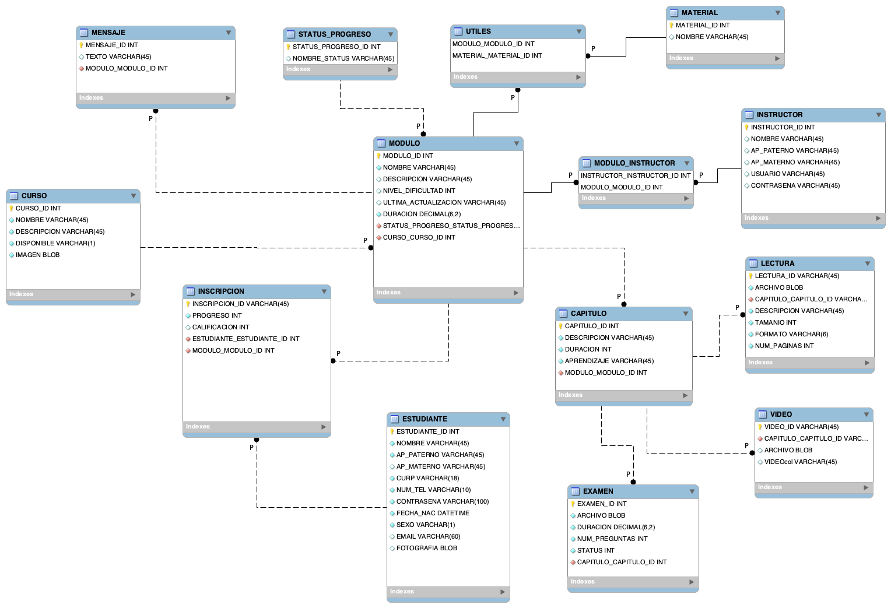

# Modelo relacional

Considerando las reglas de negocio propuesta en la documentación general que se puede leer [aquí](https://github.com/SamArtGS/Moremy/blob/master/Docs/README.md)

El modelo relacional del proyecto se realizó de la siguiente forma:

