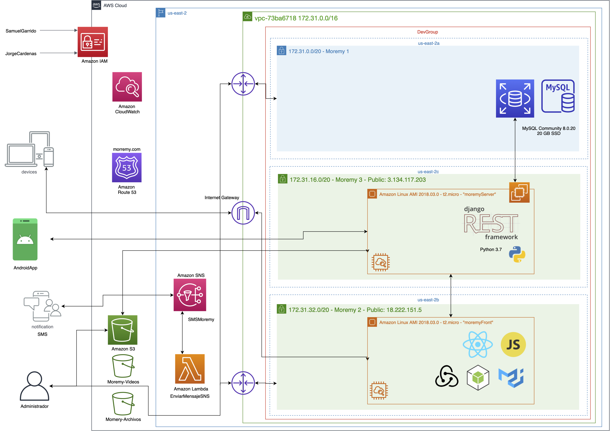

  

# Moremy 🛠

## Problemática

Vivimos en medio de lo que es potencialmente una de las mayores amenazas en nuestra vida para la educación global, una gigantesca crisis educativa. Al 28 de marzo de 2020, la pandemia COVID-19 está causando que más de 1,600 millones de niños y jóvenes no asistan a la escuela en 161 países. Esto es cerca del 80% de los estudiantes inscritos en el mundo.  Ya estábamos experimentando una crisis de ámbito global, ya que muchos estudiantes estaban en la escuela, pero no estaban aprendiendo las habilidades fundamentales necesarias para la vida. 

### Estadística

- En México hay 80.6 millones de usuarios de internet y 86.5 millones de usuarios de teléfonos celulares - ENDUTIH 2019.
- El 76.6% de la población urbana es usuaria de internet. En la zona rural la población usuaria se ubica en 47.7 por ciento.
-  Hay 80.6 millones de usuarios de internet, que representan 70.1% de la población de seis años o más. Esta cifra revela un aumento de 4.3 puntos porcentuales respecto de la registrada en 2018 (65.8%) y de 12.7 puntos porcentuales respecto a 2015 (57.4 por ciento). [Fuente](http://www.ift.org.mx/comunicacion-y-medios/comunicados-ift/es/en-mexico-hay-806-millones-de-usuarios-de-internet-y-865-millones-de-usuarios-de-telefonos-celulares)
- Conforme al Módulo de Trabajo Infantil 2017, la primera causa por la que la población de 12 a 14 años no asiste a la escuela es por falta de interés, aptitud o requisitos para ingresar a la escuela (48.3%), seguida por la falta de recursos económicos (14.2 por ciento)
- De acuerdo con la Encuesta Intercensal 2015, el 2% de los niños de 6 a 11 años no asisten a la escuela. En el grupo de 12 a 17 años, aumenta a 16.2 por ciento.
- En 2015, el 2.7% de la población de 6 a 11 años que asiste a la escuela tiene que trasladarse a otro municipio de la misma entidad para ir a lugar donde estudia.

### Propuesta

Definiendo los parámetros anteriores, se propone una plataforma de aprendizaje de oficios, donde sabiendo que una gran cantidad de personas de los 80 millones que acceden a internet son parte de los...

### Arquitectura

